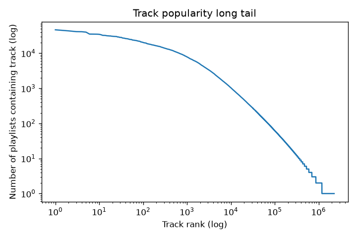
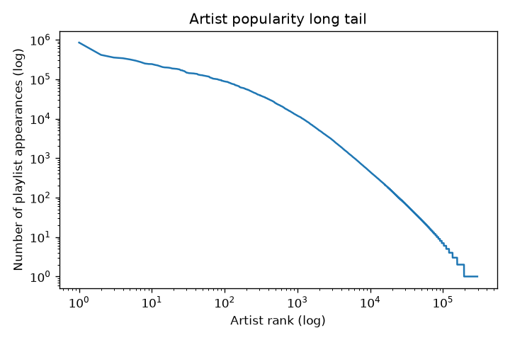
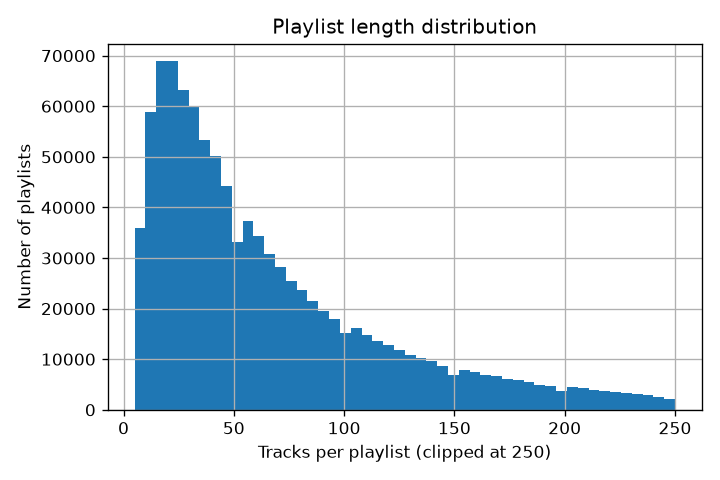
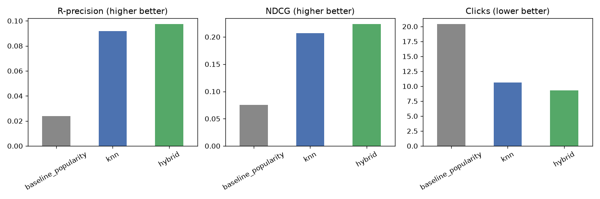
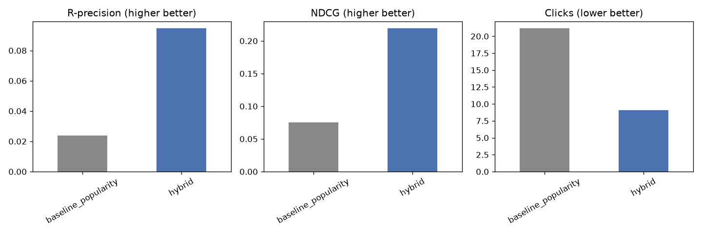

# Spotify Automatic Playlist Continuation

**ES 335 Course Project, IIT Gandhinagar**

An end-to-end study on the [Spotify Million Playlist Dataset](https://research.atspotify.com/publications/introducing-the-million-playlist-dataset-and-recsys-challenge-2018/) (MPD): given a playlist with only some of its tracks known, predict the rest. This is the task behind the RecSys Challenge 2018.

Code: [github.com/keshtib07-ghost/spotify-apc](https://github.com/keshtib07-ghost/spotify-apc)

---

## 1. The task

Automatic Playlist Continuation (APC) mimics what Spotify actually needs: a user has built part of a playlist, and the system should suggest what comes next. The official challenge frames this as several scenarios of varying difficulty, based on how much of the playlist is revealed as a "seed":

- Title only, 0 seed tracks (pure cold start)
- 1 seed track
- 5 seed tracks
- 10 seed tracks
- 25 seed tracks

We reproduce this setup ourselves: for a held-out set of playlists, we reveal only the first *k* tracks and ask the model to predict the rest, then score the prediction against the tracks we hid.

**Metrics** (matching the official challenge definitions), computed in [`src/metrics.py`](../src/metrics.py):

- **R-precision** — of the top *R* recommendations (*R* = number of hidden tracks), what fraction are correct.
- **NDCG** — rewards getting relevant tracks *near the top* of the recommendation list, not just anywhere in it.
- **Clicks** — how many groups of 10 tracks (as if scrolling Spotify's "Recommended Songs" panel) you'd have to look through before finding one relevant track. Lower is better; capped at 51 if never found.

## 2. The data

The MPD contains **1,000,000 playlists**, released as 1000 JSON slices of 1000 playlists each (~32 GB total). We built a streaming loader ([`src/build_dataset.py`](../src/build_dataset.py)) that processes one slice at a time and writes out compact Parquet tables — this keeps memory use bounded regardless of dataset size, so the same script runs on a 50k-playlist dev subset or the full 1M.

| | Full dataset (1M playlists) |
|---|---|
| Unique tracks | 2,262,292 |
| Unique artists | 295,860 |
| Unique albums | 734,684 |
| Total interactions | 66,346,428 |
| Median playlist length | 49 tracks |
| Playlists that are collaborative | 2.3% |

**The single most important finding from EDA:** even at full scale, **47.4% of all tracks appear in only one playlist.** This is a brutal long tail — half the catalog has essentially no collaborative signal to learn from.





This finding directly shaped our modeling decisions: a pure collaborative-filtering model will do fine on the popular head of the catalog and fail on the long tail, so any credible system needs a fallback for the cases collaborative filtering can't cover.

## 3. Models

We evaluated three approaches, in increasing order of sophistication, all trained only on data available at prediction time (no leakage of hidden ground-truth tracks — see [`src/make_eval_split.py`](../src/make_eval_split.py)):

1. **Popularity baseline** ([`src/baseline_popularity.py`](../src/baseline_popularity.py)) — always recommend the globally most popular tracks not already in the seed. The floor every real model must beat.

2. **Item-based collaborative filtering** ([`src/knn_model.py`](../src/knn_model.py)) — for each seed track, find training playlists that also contain it, pool the tracks in those playlists, and rank candidates by co-occurrence count normalized by popularity (an inverse-item-frequency adjustment so it doesn't just collapse back into a popularity ranking).

3. **Matrix factorization (ALS)** ([`src/als_model.py`](../src/als_model.py), combined into a hybrid in [`src/hybrid_model.py`](../src/hybrid_model.py)) — `implicit`'s Alternating Least Squares learns a latent vector per playlist and per track from the playlist-track interaction matrix. Because held-out playlists are included as rows in the training matrix (with only their seed tracks visible), ALS naturally "folds in" a latent vector for them from just those seed tracks.

**The cold-start gap.** ALS has nothing to fold in for a playlist with zero seed tracks (title-only) — there's no interaction data to build a latent vector from. Our **hybrid model** handles this explicitly: use ALS whenever a playlist has at least one seed track, fall back to the popularity ranking when it doesn't. This mirrors how a production system would actually need to be built — a single model rarely covers every scenario, and knowing where a model's coverage runs out (and having a fallback ready) matters as much as the model itself.

## 4. Results

We first iterated on a 50k-playlist dev subset (fast, ~15s to rebuild), then confirmed the winning approach at full scale (1M playlists, 10,000 held-out eval playlists).

### Dev subset (50k playlists, 2,000 eval playlists)



| Model | R-precision | NDCG | Clicks |
|---|---|---|---|
| Popularity | 0.024 | 0.075 | 20.4 |
| Item-based CF | 0.092 | 0.207 | 10.6 |
| **Hybrid (ALS + popularity fallback)** | **0.097** | **0.223** | **9.3** |

Item-based CF's cost per prediction scales with how many playlists share a seed track — fine at dev scale, but expensive for popular tracks once the catalog reaches a million playlists. ALS's cost is a fixed-size matrix multiply regardless of dataset size, so we carried the hybrid model forward to the full run and kept item-based CF as a dev-scale comparison point.

### Full dataset (1M playlists, 10,000 eval playlists)



| Model | R-precision | NDCG | Clicks |
|---|---|---|---|
| Popularity | 0.024 | 0.075 | 21.2 |
| **Hybrid (ALS + popularity fallback)** | **0.095** | **0.219** | **9.1** |

The full-scale numbers closely match the dev subset, which is itself a useful result: a well-designed dev subset is a reliable proxy for iteration, so most tuning work doesn't need the full 32 GB dataset.

**By seed length** (hybrid model, full dataset):

| Seed tracks revealed | R-precision | NDCG | Clicks |
|---|---|---|---|
| 0 (title only) | 0.026 | 0.080 | 20.5 |
| 1 | 0.103 | 0.232 | 6.5 |
| 5 | 0.120 | 0.268 | 5.8 |
| 10 | 0.117 | 0.264 | 5.9 |
| 25 | 0.111 | 0.264 | 5.5 |

Two things stand out. First, going from 0 to 1 seed track is by far the biggest jump — a single track gives the model something to latch onto. Second, performance is roughly flat from 5 to 25 seeds rather than climbing further; a handful of tracks is already enough for ALS to place a playlist in latent space, and additional tracks mostly refine rather than transform that placement.

## 5. Discussion & limitations

- **The long tail is the real bottleneck, not the model.** With 47% of tracks as singletons, no amount of collaborative-filtering sophistication recovers a track that essentially has no co-occurrence signal. A stronger next step would be a content-based model (audio features, artist/genre embeddings) that can recommend tracks it has never seen co-occur with anything, purely from metadata similarity.
- **Cold start (0 seed tracks) is capped near the popularity floor by construction.** Any model that only has a playlist title to go on needs to actually use the *text* of the title (e.g. matching "workout" or "chill" playlists by name) — we did not build a title-based model in this pass.
- **We evaluate against our own held-out split, not the official challenge leaderboard.** The official RecSys Challenge 2018 test set has no public ground truth (the AICrowd leaderboard for it is no longer active), so we built an equivalent evaluation ourselves, following the same seed-track scenarios and metric definitions, to get a fair and reproducible number.

## 6. Reproducing this

```bash
# one-time setup (Python 3.13 - implicit lacks wheels for 3.14 at time of writing)
py -3.13 -m venv .venv
./.venv/Scripts/pip install -r requirements.txt

cd src
python build_dataset.py --n-slices 50 --out-name dev50k   # or --n-slices 1000 --out-name full
python eda.py --name dev50k
python make_eval_split.py --name dev50k --n-eval 2000
python baseline_popularity.py --name dev50k
python knn_model.py --name dev50k
python hybrid_model.py --name dev50k
python compare_models.py --name dev50k
```

Full project log with dated entries: [`LOG.md`](../LOG.md).
